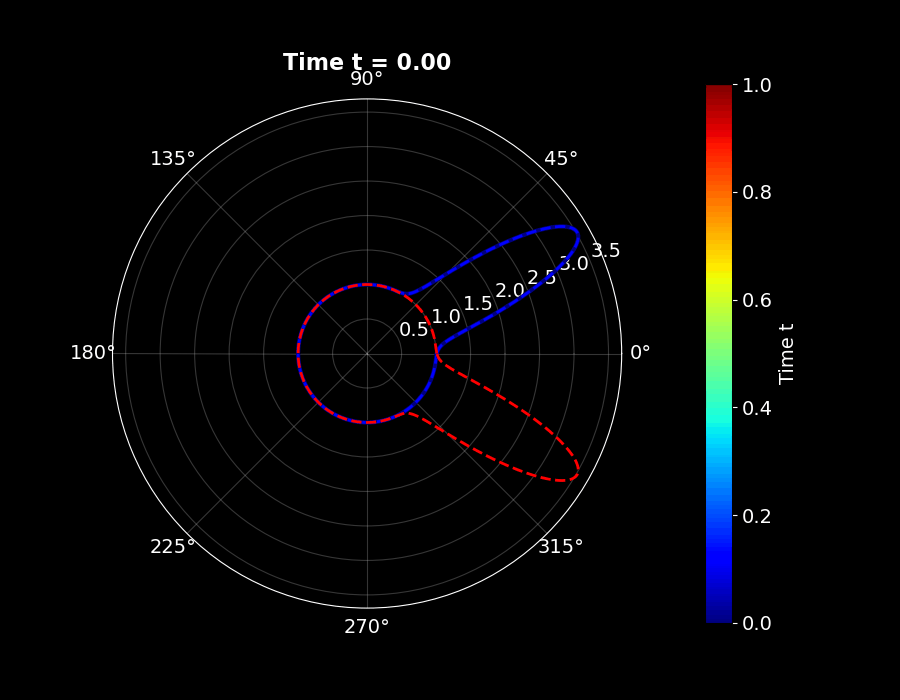
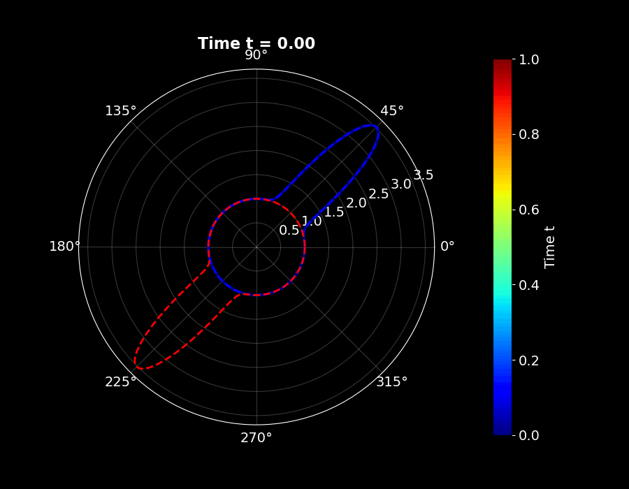
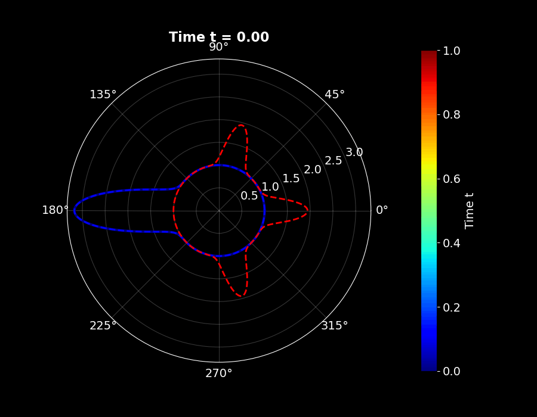
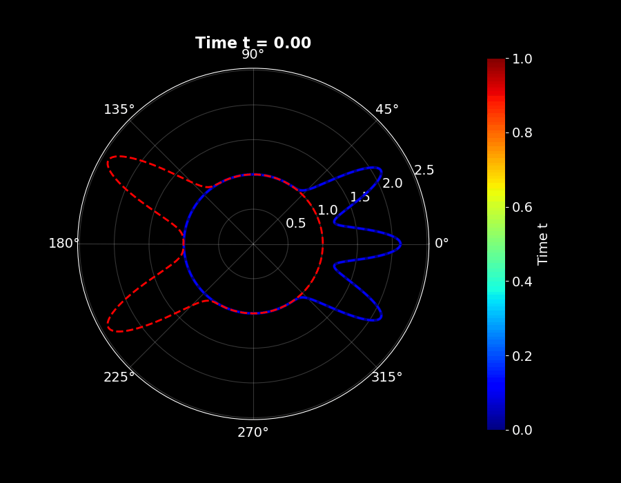
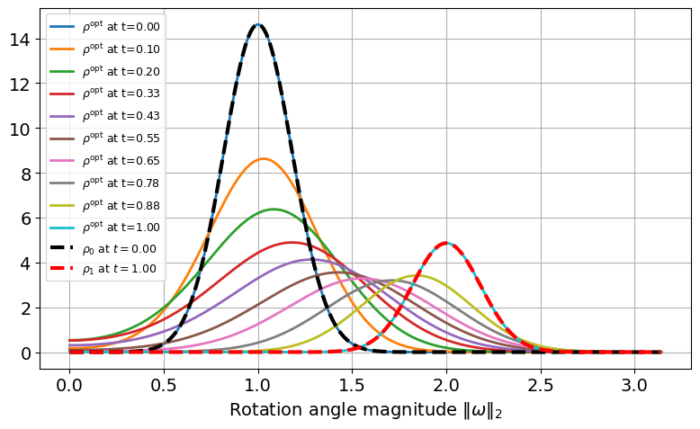
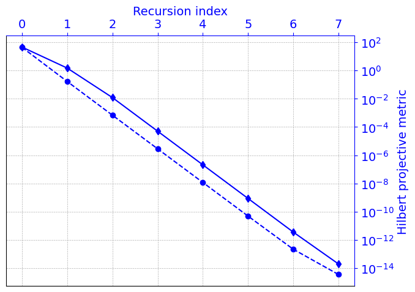
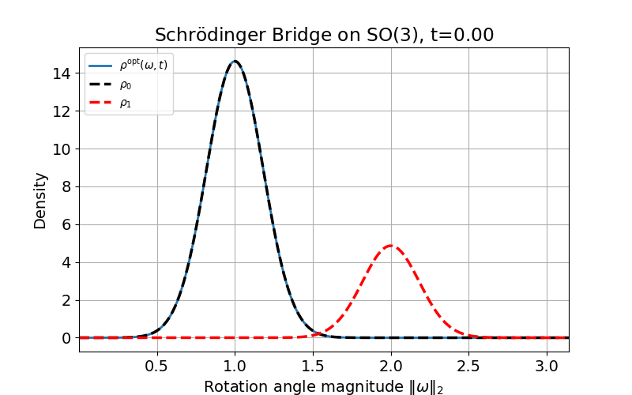

# Schrödinger Bridges on Lie Groups: SO(2) and SO(3)

This repository contains **Python implementations of Schrödinger Bridge Problems (SBP)** on compact Lie groups.

## Project Page

The project webpage with animations and additional details is available here:

🔗 https://gradslab.github.io/SbpLieGroups/

## Simulation Scenarios

Two geometries are studied:

- **SO(2)** — probability transport on the circle
- **SO(3)** — probability transport on the 3D rotation group

Both implementations use **log-domain Sinkhorn (IPFP) iterations** combined with **spectral or FFT-based convolution** to compute entropic optimal transport on manifolds.

The code demonstrates how probability distributions evolve smoothly between prescribed initial and terminal densities.

All generated figures and animations are saved in the **`assets/` folder**.

---

# Repository Structure

```
.
├── schrodinger_bridge_so2.py
├── schrodinger_bridge_so3.py
├── requirements.txt
├── README.md
└── assets/
```

The `assets/` directory contains figures and animations produced by the simulations.

---

# Installation

Clone the repository

```bash
git clone https://github.com/yourusername/schrodinger-bridges-lie-groups.git
cd schrodinger-bridges-lie-groups
```

Install dependencies

```bash
pip install -r requirements.txt
```

Dependencies:

```
numpy
matplotlib
pillow
```

---

# Running the Simulations

### SO(2)

```bash
python schrodinger_bridge_so2.py
```

### SO(3)

```bash
python schrodinger_bridge_so3.py
```

Both scripts will

1. solve the Schrödinger bridge problem
2. compute time-marginal densities
3. generate figures
4. generate animations

All outputs are saved to

```
assets/
```

---

# Schrödinger Bridge Problem

The Schrödinger bridge solves the stochastic control problem

```math
\min_{\rho_t}
\; \mathrm{KL}\!\left(\rho_t \,\|\, \text{Brownian motion}\right)
```

subject to

```math
\rho_0 = p_0, \qquad
\rho_T = p_1
```

The solution produces the **most likely stochastic evolution** connecting two probability distributions.

---

# Part I — Schrödinger Bridge on SO(2)

We first study probability transport on the circle

```math
SO(2) \cong \mathbb{S}^1
```

---

## Discretization

The circle is discretized using

```
N = 1024
```

grid points

```math
\theta_i = \frac{2\pi i}{N}, \qquad i=0,\dots,N-1
```

---

## Heat Kernel on SO(2)

The isotropic heat kernel is

```math
K_t(\theta)
=
\frac{1}{2\pi}
\sum_{k\in\mathbb{Z}}
\exp\!\left(-\frac{1}{2}\sigma^2 k^2 t\right)
e^{ik\theta}
```

Convolutions with the heat kernel are evaluated using the **Fast Fourier Transform (FFT)**.

Spectral multipliers are

```math
\lambda_t(k)
=
\exp\!\left(-\frac{1}{2}\sigma^2 k^2 t\right)
```

---

## Log-Domain Sinkhorn Algorithm

The discrete Schrödinger system is

```math
u(\theta)(K_1 * v)(\theta) = \rho_0(\theta)
```

```math
v(\theta)(K_1 * u)(\theta) = \rho_1(\theta)
```

For numerical stability we introduce

```math
a = \log u, \qquad b = \log v
```

with updates

```math
a \leftarrow \log \rho_0 - \log(K_1 * e^b)
```

```math
b \leftarrow \log \rho_1 - \log(K_1 * e^a)
```

---

## Recovering Intermediate Densities

For each time

```math
t \in [0,1]
```

the bridge density is reconstructed as

```math
\rho_t(\theta)
\propto
(K_t * e^{a-s_a})(\theta)
(K_{1-t} * e^{b-s_b})(\theta)
```

Normalization ensures

```math
\int_0^{2\pi} \rho_t(\theta)\, d\theta = 1
```

---

# SO(2) Simulation Results

## Test Case 1 — Nearby Peaks

<p align="center">

</p>

<p align="center">

</p>

<p align="center">

</p>

---

## Test Case 2 — Antipodal Peaks

<p align="center">

</p>

<p align="center">

</p>

<p align="center">

</p>

---

## Test Case 3 — One Peak → Three Peaks

<p align="center">

</p>

<p align="center">

</p>

<p align="center">

</p>

---

## Test Case 4 — Three Peaks → Two Peaks

<p align="center">

</p>

<p align="center">

</p>

<p align="center">

</p>

---

# Part II — Spectral Schrödinger Bridge on SO(3)

We now consider the Schrödinger bridge problem on the rotation group

```math
SO(3)
```

using a **spectral zonal harmonic representation**.

---

## Heat Semigroup Representation

The heat semigroup acts spectrally as

```math
K_t f
=
\sum_{\ell=0}^{\infty}
e^{-\ell(\ell+1)\sigma^2 t}
\hat f_\ell
\chi_\ell(\omega)
```

where

- $\chi_\ell$ are the **characters of SO(3)**
- $\hat f_\ell$ are spectral coefficients.

---

## Bridge Density Representation

The optimal density evolves as

```math
\rho_t(\omega)
=
(K_t u)(\omega)
(K_{T-t} v)(\omega)
```

where $u$ and $v$ are computed using the **log-domain Sinkhorn algorithm**.

---

# SO(3) Example Results

## Density Evolution



---

## Sinkhorn Convergence (Hilbert Metric)



---

## Bridge Animation



The animation illustrates the time evolution

```math
\rho_t(\omega)
```

between the prescribed marginal densities.

---

# Key Features of the Implementation

- FFT-based convolution on **SO(2)**
- Spectral heat kernel representation on **SO(3)**
- Stabilized **log-domain Sinkhorn algorithm**
- Hilbert projective metric convergence diagnostics
- High-quality scientific visualizations
- Density evolution animations

---

# Mathematical Background

The algorithms build on ideas from

- Schrödinger (1931)
- Sinkhorn (1967)
- Léonard (2014)
- Peyré & Cuturi (2019)

Core concepts include

- entropic optimal transport
- Schrödinger bridges
- heat kernels on Lie groups
- Hilbert projective metric contraction

---

# Possible Extensions

Future directions include

- Schrödinger bridges on **SE(3)**
- non-zonal densities on **SO(3)**
- GPU acceleration
- comparison with classical Wasserstein optimal transport

---

# License

MIT License
